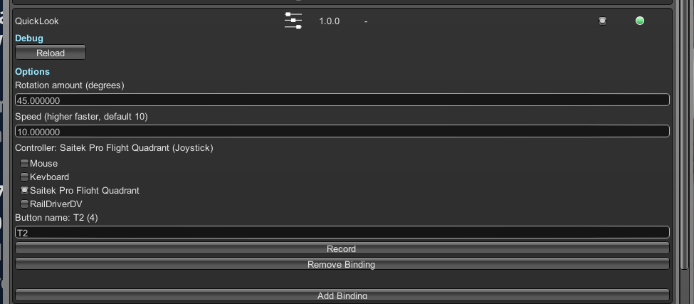

# Derail Valley Quick Look Mod

A mod for the game [Derail Valley](https://store.steampowered.com/app/588030/Derail_Valley/) that adds keybindings for "quick looking" down 45 degrees so you can see your train controls:

## Install

Download the zip and use Unity Mod Manager to install it.

## Usage

Open the mod settings and add a binding for your device. Then press it in-game to have your camera move.

## Ideas

- quick look left/right/up too

## Development

Template from https://github.com/derail-valley-modding/template-umm

Created in VSCode (with C# and C# Dev Kit extensions) and MSBuild.

1. Run `msbuild` in root to build

## Publishing

1. Run `.\package.ps1`
